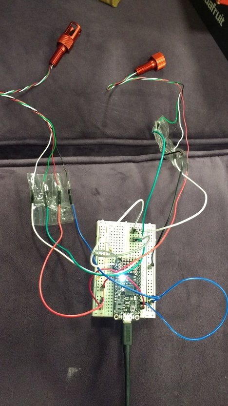
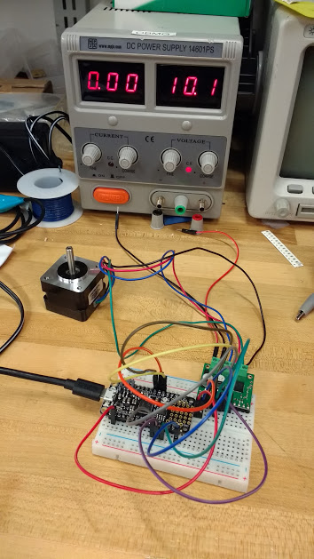

# tingly-tentacle

# pololu stepper motor

- 1208 Stepper Motor: Bipolar, 200 Steps/Rev, 35×28mm, 10V, 0.5 A/Phase = 12.95
- https://www.pololu.com/product/1208

# pololu motor driver

- 2970 AMIS-30543 Stepper Motor Driver Carrier = 19.95
- https://www.pololu.com/product/2970
- http://www.onsemi.com/pub/Collateral/AMIS-30543-D.PDF
- https://github.com/pololu/amis-30543-arduino/

# blue robotics TSYS01

- https://github.com/bluerobotics/BlueRobotics_TSYS01_Library

# blue robotics MS5837

- http://docs.bluerobotics.com/bar30/
- https://github.com/bluerobotics/BlueRobotics_MS5837_Library

peristaltic pump system:
http://www.maschinenreich.com/wp-content/uploads/2017/03/XP88-Manual-A4-170320.pdf
